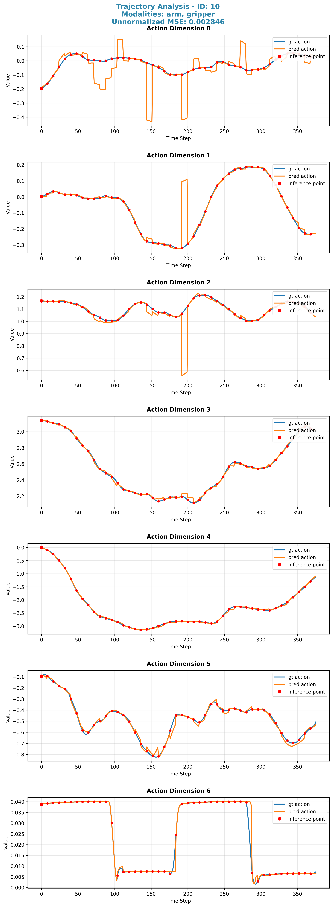

# VLA-0-Speedup: 20x Faster VLA-0 Model Training

## Project Overview
This project is an **accelerated version of the VLA-0 project** with **20x faster training speed**. It is a lightweight replication of NVIDIA's [Isaac-GR00T](https://github.com/NVIDIA/Isaac-GR00T) project, optimized by reworking core logic from VLA-0 (leveraging ideas from the VLA-0 paper) — including dataset loading, model input preprocessing, and output postprocessing pipelines.

The core goal is to retain the core capabilities of VLA (Vision-Language-Action) models while drastically improving training efficiency, making it easier to iterate on VLA model development for robotic manipulation tasks.



## Key Features
- **20x Faster Training**: Optimized dataset loading and data processing pipelines (inspired by GR00T's sharded dataloader design).
- **GR00T Compatibility**: Follows GR00T's data preparation and evaluation workflows for seamless integration with existing GR00T-based benchmarks (e.g., LIBERO).
- **VLA-0 Ideology**: Retains the core vision-language-action design principles from the VLA-0 paper.
- **Flexible Model Support**: Compatible with any version of Qwen3-VL (we use `qwen3-vl-2b` by default).

## Quick Start

### 1. Environment Preparation
Ensure you have the following dependencies installed (consistent with GR00T's requirements):
- Python 3.10+
- CUDA-enabled GPU (RTX 4090/H100 recommended for acceleration)
- `uv` (package manager, same as GR00T)
- PyTorch 2.8+ with CUDA 12.0+

```bash
# Clone the repo
git clone https://github.com/your-username/VLA-0-Speedup.git
cd VLA-0-Speedup

# Setup virtual environment
uv venv
source .venv/bin/activate
uv pip install -r requirements.txt
```

### 2. Data Preparation
Strictly follow the LIBERO spatial dataset preparation process from GR00T:
```bash
# Download LIBERO spatial dataset (LeRobot format)
huggingface-cli download \
    --repo-type dataset IPEC-COMMUNITY/libero_spatial_no_noops_1.0.0_lerobot \
    --local-dir data/libero_spatial_no_noops_1.0.0_lerobot/

# Copy modality config (GR00T-compatible)
cp datasets/modality.json datasets/libero_spatial_no_noops_1.0.0_lerobot/meta/
```
For full details, refer to: [GR00T LIBERO Spatial Finetune Guide](https://github.com/NVIDIA/Isaac-GR00T/blob/main/examples/LIBERO/README.md#finetune-libero-spatial-dataset)

### 3. Model Preparation
Download the Qwen3-VL model (any version is supported; we use 2B params):
```bash
# Download Qwen3-VL-2B (Hugging Face)
huggingface-cli download Qwen/Qwen3-VL-2B --local-dir models/qwen3-vl-2b
```

### 4. Model Training
Adjust hyperparameters in `finetune.sh` (e.g., `NUM_GPUS`, `learning_rate`, `dataset_path`) and launch training:
```bash
# Modify finetune.sh to match your environment (e.g., GPU count, model path)
vim finetune.sh

# Start training
bash finetune.sh
```
Key optimized parameters in `finetune.sh`:
- Sharded dataloader (enabled by default for 20x speedup)
- Optimized input preprocessing (color jitter + state dropout with GR00T's params)
- Batch size scaling (adjust `global_batch_size` based on your GPU memory)

### 5. Model Validation
Follow GR00T's server-client evaluation framework:

#### Step 1: Launch Policy Server
```bash
python robot/eval/run_gr00t_server.py \
    --model-path models/qwen3-vl-2b \
    --embodiment-tag LIBERO_PANDA \
    --device cuda:0
```

#### Step 2: Run Rollout Evaluation
```bash
python robot/eval/rollout_policy.py \
    --n_episodes 10 \
    --policy_client_host 127.0.0.1 \
    --policy_client_port 5555 \
    --env_name robocasa_panda_omron/OpenDrawer_PandaOmron_Env \
    --n_action_steps 8
```

## Project Structure
```
VLA-0-Speedup/
├── configs/          # GR00T-compatible configs (modality.json, etc.)
├── data/             # Dataset directory (LIBERO/GR00T format)
├── models/           # Qwen3-VL model weights
├── robot/
│   ├── eval/         # GR00T-compatible evaluation scripts
│   │   ├── run_gr00t_server.py  # Policy server (optimized for speed)
│   │   └── rollout_policy.py    # Rollout evaluation client
│   └── train/        # Optimized training logic
├── finetune.sh       # Training launch script (GR00T-style)
└── requirements.txt  # Dependencies
```

## Optimization Details
| Module               | Optimization (vs. VLA-0)                                                                 |
|----------------------|------------------------------------------------------------------------------------------|
| Dataset Loading      | Sharded dataloader (from GR00T) + multi-threaded prefetching (20x speedup)                |
| Input Preprocessing  | Batch-wise color jitter + state dropout (GR00T params) + tensor fusion                    |
| Output Postprocessing| Optimized action denoising (diffusion transformer head from GR00T)                        |
| Training Loop        | Mixed precision training + gradient accumulation (matched to GR00T's DiT architecture)    |

## References
1. **NVIDIA Isaac GR00T**: [https://github.com/NVIDIA/Isaac-GR00T](https://github.com/NVIDIA/Isaac-GR00T) (core design reference)
2. **VLA-0**: [https://github.com/NVlabs/vla0.git](https://github.com/NVlabs/vla0.git) (core design reference)
3. **Qwen3-VL**: [https://github.com/QwenLM/Qwen-VL](https://github.com/QwenLM/Qwen-VL) (base vision-language model)
4. **LIBERO Benchmark**: [https://libero-project.github.io/main.html](https://libero-project.github.io/main.html) (evaluation dataset)

## License
This project is licensed under the MIT License - see the [LICENSE](LICENSE) file for details.

## Acknowledgments
- NVIDIA for open-sourcing the GR00T project and providing reference implementations.
- The VLA-0 research team for foundational VLA model ideas.
- Alibaba Cloud for the Qwen3-VL model.
